<h2>Group Policy Account Lockout Configuration</h2>

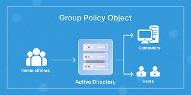

Group Policy Objects (GPOs) are used in Active Directory environments to centrally manage and enforce configuration settings across computers and users in a domain. 
Administrators use Group Policy to apply security rules, password policies, software configurations, and many other system settings from the domain controller.

In this lab, Group Policy is used to configure an <b>Account Lockout Policy</b>. This policy protects user accounts from brute-force attacks by locking the account after a certain number of failed login attempts. When the threshold is reached, the account becomes locked and the user cannot log in again until the lockout timer expires or an administrator manually unlocks the account.

  

<h3>Opening the Group Policy Management Console</h3>

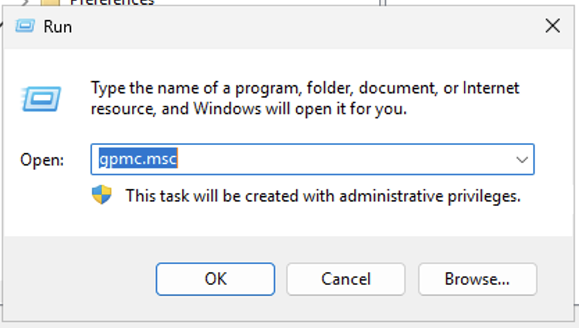

The first step is opening the <b>Group Policy Management Console (GPMC)</b>. 
This console is where administrators manage domain policies and control how security rules apply to users and computers.

To open it, press <b>Windows + R</b> to open the Run dialog box and type:

<pre>gpmc.msc</pre>

This command launches the Group Policy Management Console. From here, administrators can edit existing domain policies or create new Group Policy Objects that will apply across the domain.

Since Group Policy affects the entire domain environment, administrative privileges are required to access and modify these settings.

  

<h3>Navigating to the Account Lockout Policy</h3>

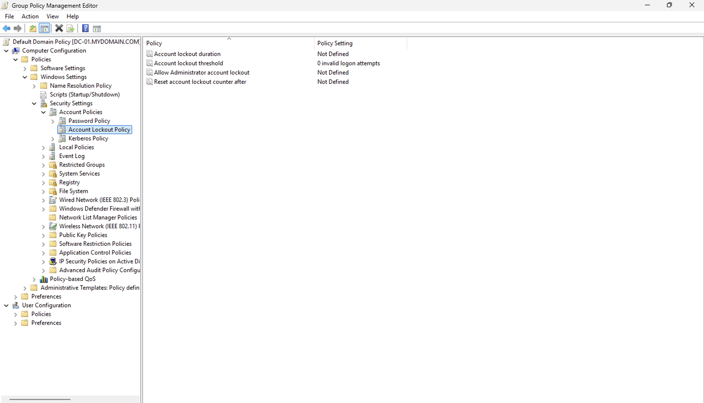

After opening the Group Policy Management Editor, the administrator navigates through the following path in the policy tree:

<pre>
Computer Configuration
   → Policies
      → Windows Settings
         → Security Settings
            → Account Policies
               → Account Lockout Policy
</pre>

This section of Group Policy contains security rules that control how the system responds when multiple failed login attempts occur.

Initially, these settings may show as <b>Not Defined</b>, meaning the domain has not yet enforced a lockout rule. Without this protection, attackers could attempt unlimited password guesses against user accounts.

Configuring these policies adds an important security layer that helps defend against brute-force authentication attacks.

  

<h3>Configuring the Account Lockout Settings</h3>

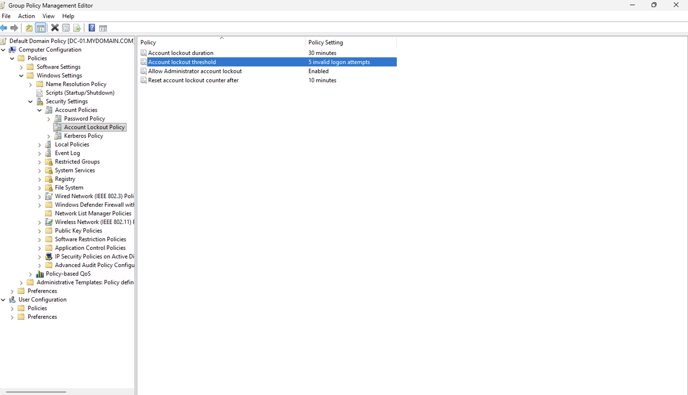

The account lockout policy is now configured with specific security values.

The settings applied are:

<ul>
<li><b>Account lockout duration:</b> 30 minutes</li>
<li><b>Account lockout threshold:</b> 5 invalid login attempts</li>
<li><b>Allow administrator account lockout:</b> Enabled</li>
<li><b>Reset account lockout counter after:</b> 10 minutes</li>
</ul>

This means that if a user enters the wrong password <b>five times</b>, the system will automatically lock the account for <b>30 minutes</b>.

The reset counter setting means that if fewer than five failed attempts occur and the user waits <b>10 minutes</b>, the system will reset the attempt counter back to zero.

These settings are commonly used in enterprise environments to prevent automated password guessing attacks.

  

<h3>Verifying the Domain Policy Settings</h3>

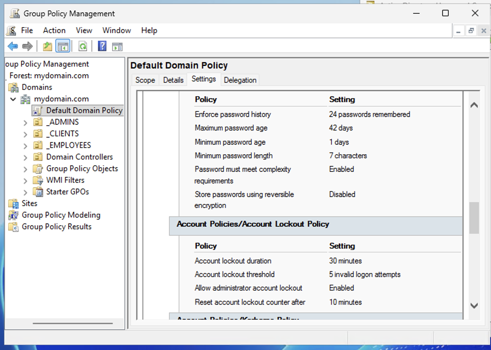

The Group Policy Management console displays the current security configuration for the domain’s <b>Default Domain Policy</b>.

This view confirms that the account lockout policy has been successfully applied to the domain.

Administrators can review all security policies here, including:

<ul>
<li>Password complexity requirements</li>
<li>Password history enforcement</li>
<li>Password age policies</li>
<li>Account lockout settings</li>
</ul>

Since the Default Domain Policy applies to all domain users, these security rules will automatically apply to every account within the Active Directory domain.

  

<h3>Testing the Lockout Policy with Remote Desktop</h3>

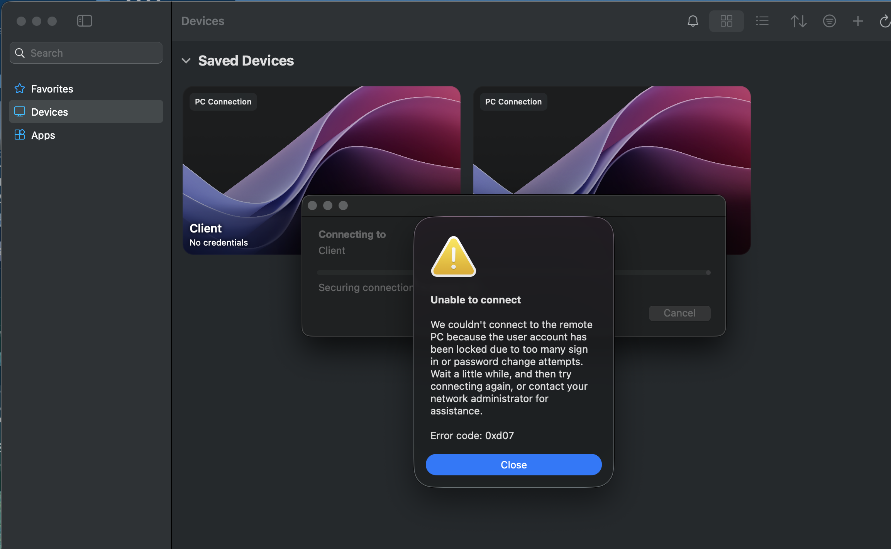

To verify that the policy works correctly, the user attempts to log into a domain machine multiple times using incorrect credentials through Remote Desktop.

After exceeding the configured threshold of <b>five failed login attempts</b>, the system locks the user account.

The Remote Desktop client displays the following message:

<b>"Unable to connect. The user account has been locked due to too many sign-in attempts."</b>

This confirms that the Group Policy lockout configuration is functioning properly. 
The account will remain locked until either the lockout duration expires or an administrator manually unlocks the account.

  

<h3>Unlocking the Locked User Account</h3>

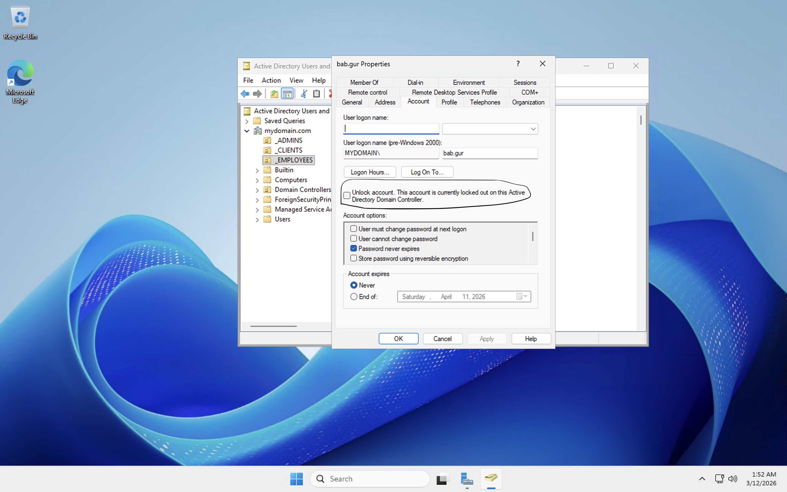

To restore access, an administrator opens <b>Active Directory Users and Computers</b> and locates the affected user account.

Inside the user’s properties window, the system shows a message indicating that the account has been locked due to the lockout policy.

Administrators can resolve this by selecting the option:

<b>"Unlock account. This account is currently locked out."</b>

Once this option is checked and applied, the user account is unlocked and can log in again immediately without waiting for the lockout timer to expire.

  

<h3>Confirming the Logged-In User</h3>

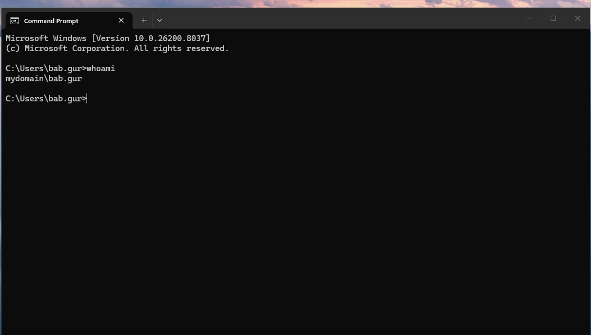

After the account is unlocked and the user successfully logs back into the system, the <b>whoami</b> command is used in the command prompt to verify the currently authenticated user.

<pre>whoami</pre>

The output shows:

<pre>mydomain\bab.gur</pre>

This confirms that the user is successfully authenticated within the Active Directory domain and that access has been restored after unlocking the account.

Using commands like <b>whoami</b> is a quick and reliable way to confirm the identity of the currently logged-in user, especially when testing domain authentication and Group Policy behavior.

<h3>Disabling the User Account</h3>

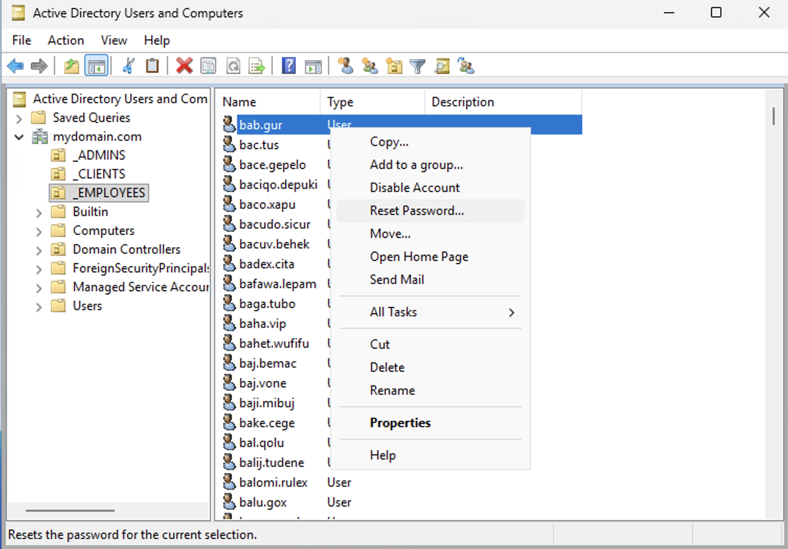

In this step, the administrator opens <b>Active Directory Users and Computers</b> and navigates to the organizational unit that contains the user accounts. 
Inside the <b>_EMPLOYEES</b> Organizational Unit, the user account <b>bab.gur</b> is located.

To simulate another security scenario, the administrator right-clicks the user account and selects <b>Disable Account</b>.

Disabling an account prevents the user from authenticating to any system in the domain. 
This is commonly done when an employee leaves the company, when an account is suspected to be compromised, or when administrators need to temporarily block access without deleting the account entirely.

Unlike deleting an account, disabling it preserves the user's information, group memberships, and permissions, allowing administrators to easily re-enable the account later if needed.

  

<h3>Confirmation that the Account Was Disabled</h3>

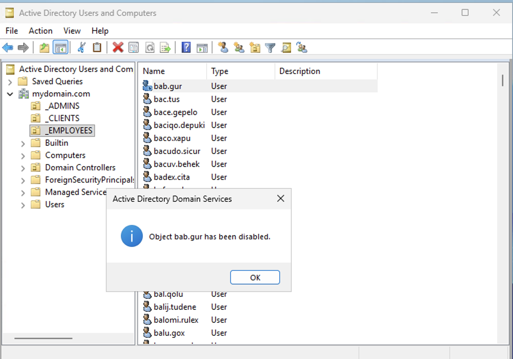

After selecting <b>Disable Account</b>, Active Directory confirms the action with a notification message stating:

<b>"Object bab.gur has been disabled."</b>

This confirms that the user account is no longer allowed to authenticate within the domain. 
At this point, any attempt to log in using this account will be rejected by the domain controller.

Administrators can visually identify disabled accounts because the user icon in Active Directory appears faded or marked differently compared to active accounts.

  

<h3>Resetting the User Password</h3>

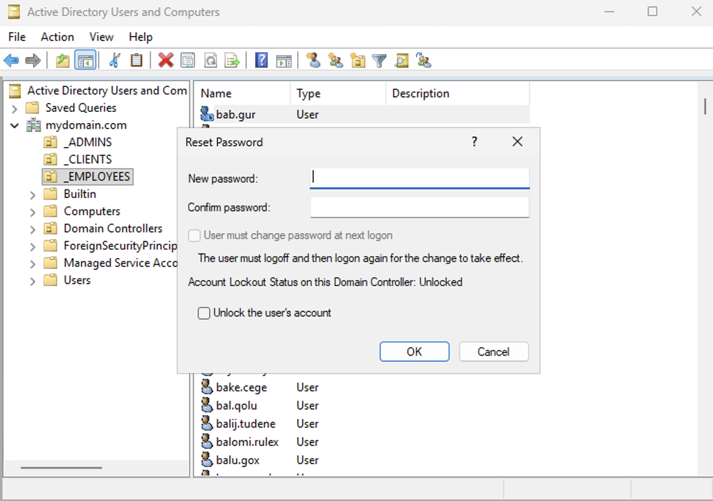

Administrators also have the ability to reset user passwords directly from Active Directory.

In this step, the administrator selects the user account and chooses <b>Reset Password</b>. 
A dialog window appears allowing the administrator to enter a new password and confirm it.

This feature is commonly used by IT support teams when users forget their passwords or when a security incident requires immediate credential changes.

The window also provides options such as:

<ul>
<li>Forcing the user to change their password at next login</li>
<li>Unlocking the user account if it was locked due to failed login attempts</li>
</ul>

Resetting passwords through Active Directory ensures the change is immediately applied across the domain.

  

<h3>Attempting to Log in With a Disabled Account</h3>

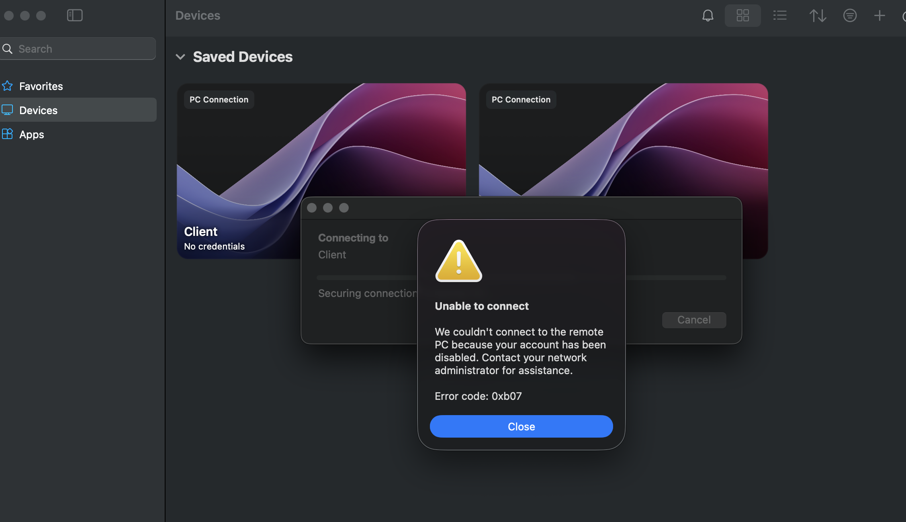

After disabling the account, the user attempts to connect to the system again using <b>Remote Desktop</b>.

Because the account has been disabled by the administrator, the authentication request is rejected by the domain controller.

The Remote Desktop client displays an error message stating that the account has been disabled and instructs the user to contact the network administrator.

This behavior confirms that Active Directory is successfully enforcing account status rules and preventing disabled accounts from accessing domain resources.

  

<h3>Opening Event Viewer to Investigate Security Logs</h3>

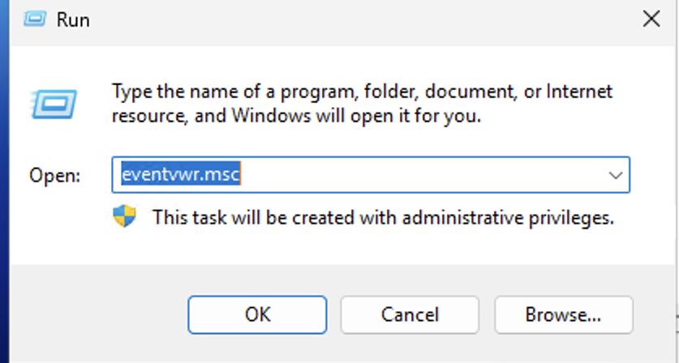

To investigate authentication activity and security events, administrators use the Windows <b>Event Viewer</b>.

The Event Viewer can be opened using the Run dialog by typing:

<pre>eventvwr.msc</pre>

Event Viewer allows administrators to review system logs that record important security events such as successful logins, failed login attempts, account lockouts, and policy changes.

These logs are critical for troubleshooting issues and for security monitoring within enterprise environments.

  

<h3>Event Viewer Overview</h3>

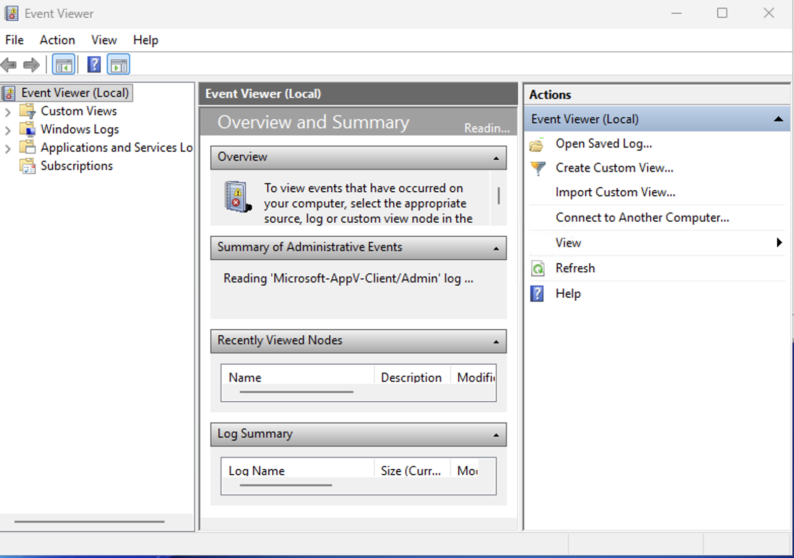

Once Event Viewer opens, administrators can navigate through several log categories including:

<ul>
<li>Application Logs</li>
<li>System Logs</li>
<li>Security Logs</li>
<li>Forwarded Events</li>
</ul>

The most important log for authentication and security monitoring is the <b>Security</b> log located under <b>Windows Logs</b>.

This log records detailed information about user authentication events and security-related activities occurring on the system.

  

<h3>Searching Security Logs for the User Activity</h3>

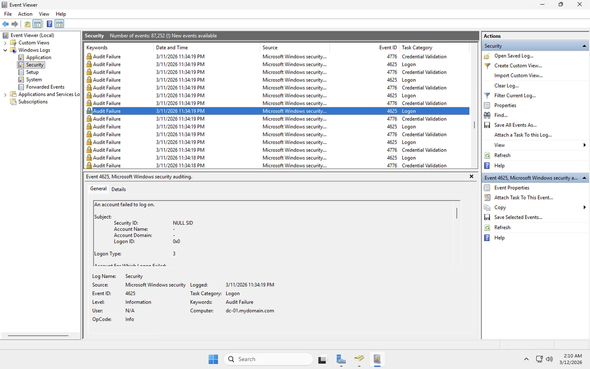

Inside the Security log, the administrator can search for specific events related to a particular user.

Using the <b>Find</b> feature, the administrator searches for the username:

<pre>bab.gur</pre>

This allows the administrator to quickly locate events associated with that user account.

For example, the displayed event shows a logoff event with <b>Event ID 4634</b>, which indicates that a user session has ended.

Security logs provide administrators with detailed auditing information that can help track user activity and identify potential security incidents.

  

<h3>Viewing Failed Login Attempts</h3>

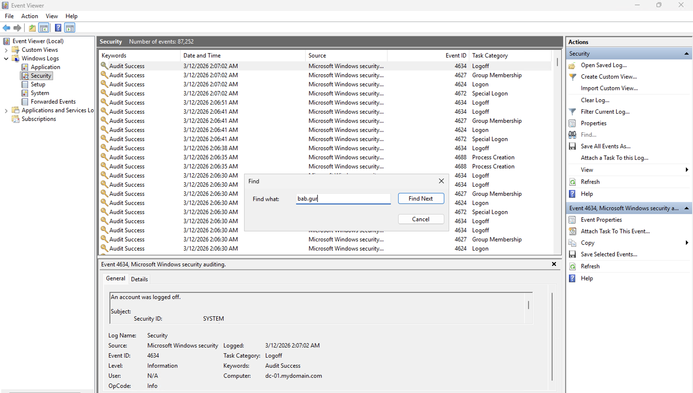

Another important type of event recorded in the Security log is an <b>Audit Failure</b>.

In this example, the log shows <b>Event ID 4625</b>, which indicates that an account failed to log in.

This event includes detailed information such as:

<ul>
<li>The time of the failed login attempt</li>
<li>The system where the login was attempted</li>
<li>The account that attempted to authenticate</li>
<li>The reason the authentication failed</li>
</ul>

Security administrators often monitor these logs to detect suspicious activity, such as repeated login failures that may indicate a brute-force attack or unauthorized access attempts.

By combining Group Policy security settings with monitoring tools like Event Viewer, organizations can better protect their Active Directory environments and quickly investigate authentication-related issues.

